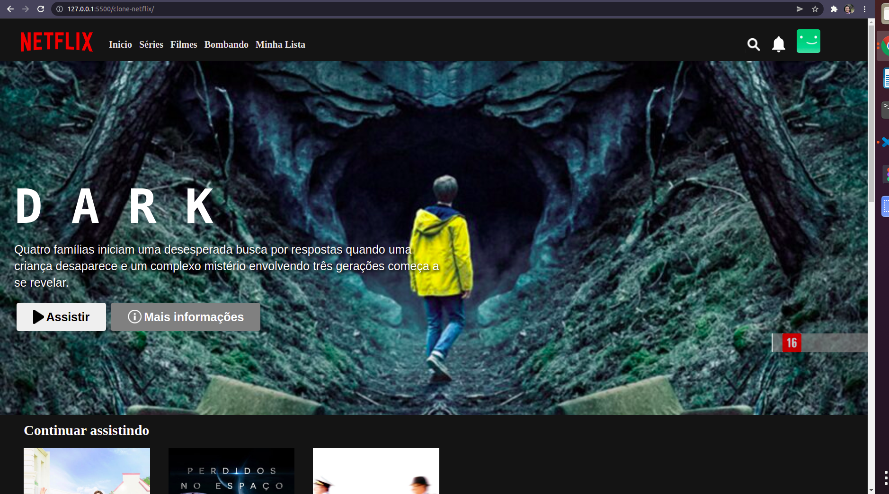

#CLONE DA PÁGINDA INICIAL DA NETFLIX

Projeto  de clone da página inicial da Netflix, usando HTML5, CSS3 e o plugin "Owl Carousel" do JQuery, sob a orientação do instrutor da Digital Innovation One Inc., Felipe Silva Aguiar.

Tecnologias:
-*HTML5* 
-*CSS3* 
-*JQuery*: Extensão **"Olw Carousel"** para exibição de imagens em carrossel.

